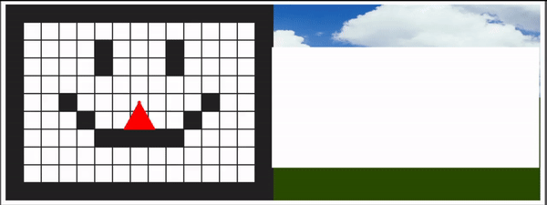

# raycasting-js
  

This is a little raycasting made with JavaScript and P5.js. Raycasting is a rendering technique that was originally implemented in Wolfenstein 3D.

You can play it here: https://magoninhoraycasting.netlify.app/

## To-do list

- [ ] Textures (I don't know how to do it yet)
- [ ] Collisions
- [ ] Real-time map editor

### This would not be possible without the help of

- Gustavo Pezzi from pikuma.com.
- javidx9 from One Lone Coder.
- Daniel Shiffman from The coding train.
- Lode's Computer Graphics Tutorial (I didn't use his method, but it was useful for the main concepts of raycasting).

I'll translate the code to python and make a tutorial soon...